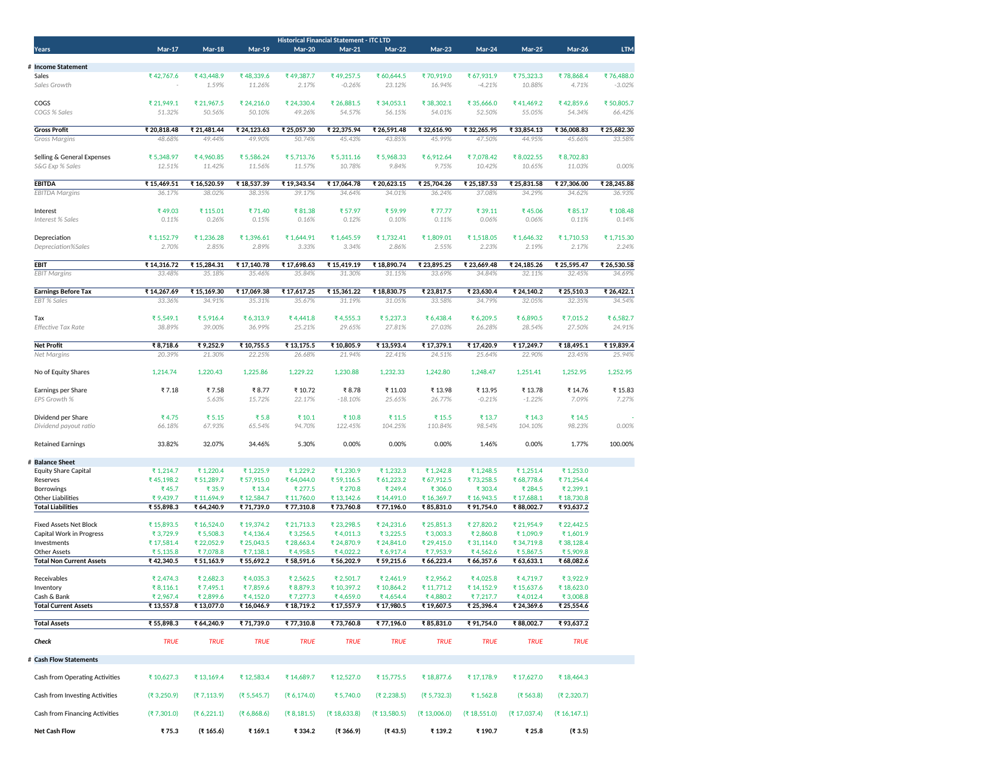

# ITC Ltd. — Historical Financial Statements & Power BI Dashboard

A 10-year historical financial model for **ITC Ltd.** (FY2017–FY2026, plus LTM and the last 10 quarters), with common-size statements, ratio analysis, a trendline forecast to FY2031, and a Power BI dashboard built on top of it.

## What this is

This project has two parts, both built off the same ITC financial data:

1. **The Excel model** — ITC's reported Income Statement, Balance Sheet, and Cash Flow Statement for FY2017–FY2026, restated into a clean, formula-linked model, with common-size statements, ratio analysis, and a simple forecast out to FY2031.
2. **The Power BI dashboard** — a one-page dashboard built from the same numbers, showing the headline metrics, growth trends, margins and returns, and balance sheet strength, all in one view.

All numbers are in ₹ Crore unless stated otherwise (per-share figures in ₹).

## Files

| File | Description |
|---|---|
| `ITC_Historical_Financial_Statements.xlsx` | The Excel model — 5 tabs, fully formula-linked |
| `ITC_PowerBI_DataModel.xlsx` | The same data, reshaped into the tables Power BI uses to build the dashboard |
| `ITC_Dashboard.pbix` | The Power BI dashboard file |
| `Report.docx` | Written summary of the full project — the numbers, trends, and how the dashboard was built |
| `screenshots/` | Snapshots of every Excel tab and the final dashboard |

## Tabs in the Excel model

1. **Historical FS** — Income Statement, Balance Sheet, and Cash Flow Statement, FY2017–FY2026 + LTM. Includes a balance-sheet check row (Total Assets = Total Liabilities, confirmed `TRUE` for every year).
2. **Common Size Statement** — Income Statement and Balance Sheet, every line as a % of Sales / Total Assets.
3. **Ratio Analysis** — growth rates, margins, returns (ROCE, ROE), turnover ratios, working-capital days, and cash-flow coverage ratios, each with a 10-year mean and median.
4. **Forecasting** — Sales, EBITDA, and EPS projected FY2027–FY2031 using Excel's `FORECAST()` (a straight-line trend off the 10 years of history).
5. **Data Sheet** — the raw source numbers every other tab pulls from. Marked "please do not make any changes" in the original file — update figures here only.

## The Power BI dashboard

One page, built to be quick to read: 5 KPI cards up top (Sales, EBITDA, Net Profit, EPS, ROE), a Sales/EBITDA/Net Profit trend line, a margin & returns trend line, and a Total Assets vs Borrowings chart that shows how little debt ITC actually carries. A year slicer lets you filter the whole page to a single year. See `Report.docx` for how it was put together.

## Key numbers (FY2017 → FY2026)

| Metric | FY2017 | FY2026 | 10-yr Mean | 10-yr Median |
|---|---|---|---|---|
| Sales (₹ Cr) | 42,768 | 78,868 | — | — |
| Sales Growth | — | 4.71% | 7.35% | 4.71% |
| EBITDA Margin | 36.17% | 34.62% | 36.26% | 36.21% |
| Net Profit Margin | 20.39% | 23.45% | 23.15% | 22.66% |
| EPS (₹) | 7.18 | 14.76 | — | — |
| Return on Equity | 18.78% | 25.51% | 21.31% | 20.98% |
| Return on Capital Employed | 30.82% | 34.40% | 30.60% | 30.47% |
| Interest Coverage | 292x | 301x | 321x | 296x |

Revenue grew at roughly a **7% CAGR** and EPS at roughly an **8% CAGR** over the decade, on a business that runs with almost no debt (interest coverage consistently above 200x). One year needs a footnote: **FY2025's net margin looks unusually high in some tabs (~46%)** because of a large one-off gain in Other Income that year — the Historical FS tab's Net Profit figure (₹17,250 Cr) already strips this out, while the Data Sheet / Common Size tabs' figure (₹34,747 Cr) doesn't. See `Report.docx` for the full explanation.

## How to use it

1. Open `ITC_Historical_Financial_Statements.xlsx` in Excel or Google Sheets. Update the **Data Sheet** tab as new results come out — everything else recalculates automatically.
2. Open `ITC_Dashboard.pbix` in Power BI Desktop to view or edit the dashboard. It's built off `ITC_PowerBI_DataModel.xlsx`, so if that file's path changes, refresh the data source in Power BI.
3. To extend the Excel forecast, add more rows to the Forecasting tab following the same `FORECAST()` pattern.

## Disclaimer

This is a historical-data and ratio-analysis project built from reported financials, not investment advice. The forecast is a simple straight-line trend projection, not a business-driven forecast, and should be treated as illustrative only.
